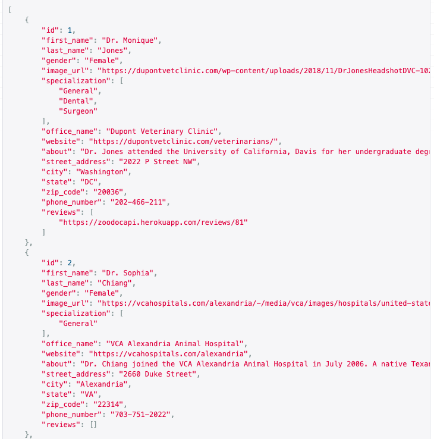
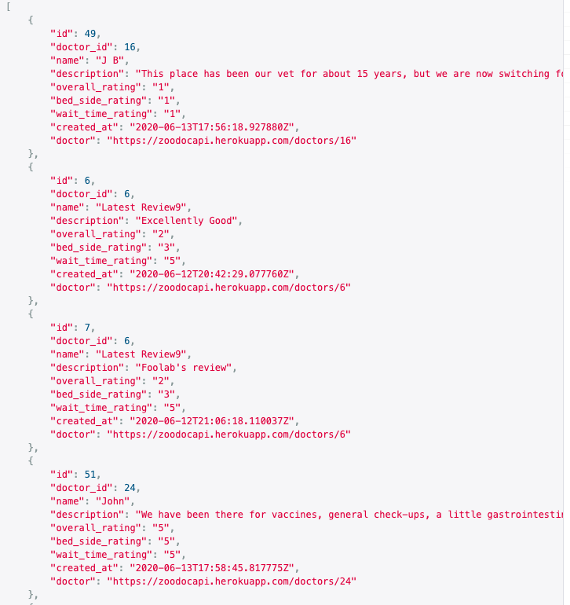
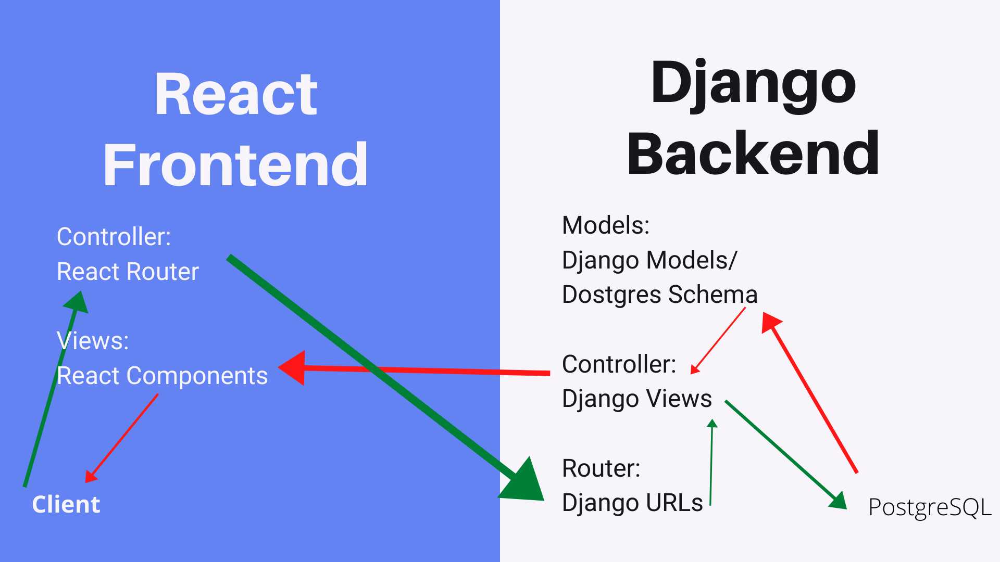

# ZooDoc-Backend

## Project Description

This project was for General Assembly's Software Engineering Immersive.

ZooDoc is a application that helps users find local vets in their area. Users are also able to rate and review vets.

Repo Links:
[Frontend Repo](https://github.com/bguayante/ZooDoc) | 
[Backend Repo](https://github.com/kristenmoran/ZooDoc-Backend)

The final result can be viewed here: [ZooDoc](https://zoodoc.herokuapp.com/)

Team Members:
Brian Guayante,
Yiling (Carol) Cui,
Foolan Bhosale,
Kristen Moran

## User Stories

- _As a user, I want to search for vets in my area_
- _As a user, I want to click on a doctor and see their information and reviews_
- _As a user, I want to leave a review on my experience with the vets and be able to edit or delete my review if I change my mind_

_**Post Stretch Goal**_

- _As a user, I want to log in with my social accounts_
- _As a user, I want to see the Doctor's office location on Google Maps._
- _As a user, I want to book an appointment through the app without going through the vet website_
- _As a user, I want to create a profile page with my pet and past appointment information_

## Models

```
class Doctor(models.Model):
    first_name = models.CharField(max_length=50)
    last_name = models.CharField(max_length=50)
    gender = models.CharField(max_length=25)
    specialization = ArrayField(models.CharField(
        max_length=100), null=True, blank=True)
    image_url = models.TextField()

    about = models.TextField()
    office_name = models.CharField(max_length=50)
    website = models.TextField()
    street_address = models.CharField(max_length=100)
    city = models.CharField(max_length=50)
    state = models.CharField(max_length=50)
    zip_code = models.CharField(max_length=10)
    phone_number = models.CharField(max_length=25)

    def __str__(self):
        return self.first_name


class Review(models.Model):

    RATING_CHOICES = (
        ('1', '1 Star'),
        ('2', '2 Stars'),
        ('3', '3 Stars'),
        ('4', '4 Stars'),
        ('5', '5 Stars'),
    )
    name = models.CharField(max_length=50)
    description = models.TextField()
    overall_rating = models.CharField(max_length=10, choices=RATING_CHOICES)
    bed_side_rating = models.CharField(max_length=10, choices=RATING_CHOICES)
    wait_time_rating = models.CharField(max_length=10, choices=RATING_CHOICES)
    created_at = models.DateTimeField(auto_now_add=True)

    updated_at = models.DateTimeField(auto_now=True)
    doctor = models.ForeignKey(
        Doctor, on_delete=models.CASCADE, related_name='reviews')

    def __str__(self):
        return self.name

```

## ZooDoc JSON Data





## ZooDoc Req-Res Cycle


## Issues/Hurdles

Custom User models were the most difficult part in the backend development. Since authorization and authentication are built into change, when you try to customize the user model it was difficult to work around. We used Simple JWT RestFramework for our custom user model. 

## Technologies and Frameworks Used

- Python, Django RestFramework, Simple JWT DjangoRestFramework, SQL

## Installation

```
Install the ZooDoc Backend:
1. Fork & clone the repository
2. Add/enhance features and technologies!
3. Submit any issues

Tips: Run pipenv install in the virtual environment of the project directory CLI to download required dependencies such as Django, Django-Rest-Framework and JWT-Authentication. Then running python3 manage.py runserver will start a local version of the backend on port 8000.
```

## Contribute

This is a group project presented for evaluation for General Assembly and is not open for outside contributions at this time. However, if you have feature suggestions to improve the usability or functionality of the application, feel free to create an Issue on this GitHub repository.

[Issue Tracker Frontend](https://github.com/bguayante/ZooDoc/issues)
[Issue Tracker Backend](https://github.com/kristenmoran/ZooDoc-Backend/issues)
